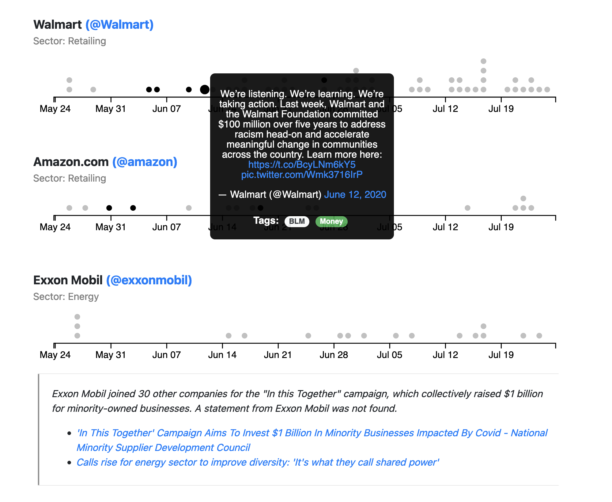

# How to develop a research question

## Twitter Scraping Inspiration

* Subreddits
    * [r/datasets](https://www.reddit.com/r/datasets/): Search here for your datasets before scraping! Sometimes someone else has already done the work.
    * [r/dataisbeautiful](https://www.reddit.com/r/dataisbeautiful/): Where data visualization fans show off their work. You'll often see the cutting-edge here.
    * [r/dataisugly](https://www.reddit.com/r/dataisugly/): Negative inspiration.
* Data journalists
    * Data journalists are often the most approachable forms of data-driven research that you can read.
    * [The Pudding](https://pudding.cool/)
    * [Washington Post Graphics](https://twitter.com/PostGraphics?ref_src=twsrc%5Egoogle%7Ctwcamp%5Eserp%7Ctwgr%5Eauthor)
    * [NYT Graphics](https://twitter.com/nytgraphics?ref_src=twsrc%5Egoogle%7Ctwcamp%5Eserp%7Ctwgr%5Eauthor)
* Data visualization projects and essays
    * [The Fortune 100 and Black Lives Matter](https://www.brownanalytics.com/fortune-100-blm-report/site/index.html):
        How did Fortune 100 companies react on Twitter to the death of George Floyd and the subsequent protests in the summer of 2020?
    * [What is Congress tweeting about?](https://congress.pudding.cool/): Topic modeling to monitor what Congress is most

## Build a research question

You may have a question like "What policy issues does Congresswoman Terri Sewell (D-AL 7th District, Princeton Class of 1986) care about?"
By scraping her account, we could collect all of her tweets and
categorize them by issue [as The Pudding did.](https://congress.pudding.cool/person/RepTerriSewell)
But what question is this *really* answering? What techniques did the Pudding
use to put their data into perspective? How effective is this answering our 
original question?

**EXERCISE:** Let's workshop on 2-3 potential research questions together.

## Typical research workflow

1. Be curious and find a question that interests you.
1. Try to find a way to answer your question with data. What kind of assumptions
are you making when you make this leap?
1. What are all the fields you need to answer this data-driven question?
1. Execute scrape.
1. Pare down data into just the information you need.
1. Enrich the dataset with any external datasets if necessary. (If manually
adding data, ensure that the time you're prepared to invest are worth the
question you're trying to answer!)
1. Analyze your data! Build charts to answer your original question. Were you wrong?
That's okay! That means you probably had a counter-intuitive result. What 
led you to be
