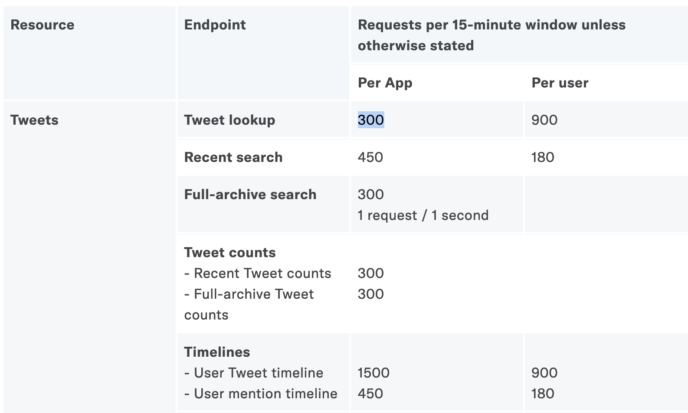

# Introduction to working with APIs

1. TOC
{:toc}

An API ("Application Programming Interface", you don't need to remember that, 
no one does) is a collection of commands you can issue over the internet to 
collect data from websites. Collecting this data is usually done over code, 
but you can also see this data by just visiting URLs in your browser.

This URL [https://api.github.com/users/princeton-cdh/repos](https://api.github.com/users/princeton-cdh/repos)
will list information about all the code under the CDH's GitHub account.
(If you're in Firefox, click on the "Raw Data" button to see things more clearly.)
This is JSON data like any other, and you could write a quick script to list 
out all the codebases we've worked on.

The power of this is that as long as you follow this formula:
```
https://api.github.com/users/{USER}/repos
```
you can get the public code bases on *any* GitHub user. From that information
we could then get a count of all assignments we have related to each project so that we
know how much work is left to do. GitHub's API is complicated, but here's a 
link to the [documentation](https://docs.github.com/en/rest/guides/getting-started-with-the-rest-api)
if you're interested.

If we didn't have an API, to accomplish something similar we'd have to scrape the CDH's
[profile page](https://github.com/Princeton-CDH), which would be *a lot* harder.
APIs store information in a clean, consistent way that makes it easy to collect
information (for better and for worse.)

## Wrappers

We just finished working with `tweepy`, a library that helps us to work with the Twitter API
in python. This is an example of a **wrapper**. APIs are built to work with any language;
all you need is an internet connection. But as we'll see, it can be clumsy to work
directly with the API, so programmers built API wrappers like `tweepy ` to 
make their code cleaner and easier to use.

If you're ever looking to work with an API, let's take Reddit as an example,
it's worth googling "reddit api python wrapper", and you'll come across libraries
that other people have used to connect to Reddit's API. For python, I recommend
[`praw`](https://github.com/praw-dev/praw).

Wrappers are simply supposed to make your life easier, but it's possible
that you're going to work with APIs that don't have wrappers in the language you
need. The New York Times API, for example, doesn't have a good python wrapper.
If you make one, publish it online, and you can help other programmers!

## API Limitations

As we'll see, it's important to understand the limitations of an API as you 
embark on a research project.
When companies like Spotify or Twitter open up their servers to connect with
other computers, they want to impose rules to make sure no one spams their
servers or scrapes their entire database too quickly. When considering how to
pursue a research question, keep "rate limiting" and "data limiting" in mind.

### Rate limiting

Rate limits are kind of like speed limits imposed by an API. If Twitter allowed
anybody to scrape every single tweet ever, it would place immense strain on their
infrastructure (and since data is their main commodity, they can sell this access
for a hefty fee.)

Rate limits [are documented here.](https://developer.twitter.com/en/docs/twitter-api/rate-limits)
We have created one app, so in each 15-minute window we can execute 300 searches.



Since each search contains a maximum of 200 tweets, we can get 60,000 tweets (!)
in 15 minutes. When just starting out, rarely will one's research questions 
reach the limit, but if you need a lot of data for your analysis, your scrape
may take days to execute if the API's rate limit is especially low. Smaller
companies probably will have stronger limitations on how
much data you can collect from their site. In the case of Facebook and TikTok, you can't
scrape data at all.

### Data Limiting

This data is highly valuable, and companies like Facebook
have decided to cut off developers from accessing that data. Spotify won't allow
programmers to access song play counts (even
though it's available in their UI.) Twitter limits users to only the latest 3200 tweets when scraping a user's timeline. You can only get the latest 100 retweets on a tweet 
[which has led to problems in the past](https://levels.io/giveaway/).

When pursuing a research question, make sure that the resources that you need
to answer that question will be fully included in the dataset you're collecting
[otherwise you may be misinforming people.](https://towardsdatascience.com/fake-follower-calculators-misinform-users-journalists-with-dubious-statistics-659b60fc4d5a)

## API Keys

If someone has your public and private key, they can log in to the API and 
make it appear like you are abusing the rate limit or even post tweets as you (!).
Never publish your private key anywhere.

## Legal 

**I AM NOT A LAWYER, THIS IS NOT LEGAL ADVICE**

As long as you're using the API, you're not doing anything illegal, but web
scraping in general (say if I wrote a script to scrape all the email addresses
from [https://www.princeton.edu/](https://www.princeton.edu/)) is quasi-illegal. 
We won't go into how to scrape
outside of APIs in these seminars, but consider that making thousands of requests to any
website can cripple its infrastructure. This is called a [Denial of Service Attack (DoS)](https://www.paloaltonetworks.com/cyberpedia/what-is-a-denial-of-service-attack-dos) and is super illegal.
So it's best to follow [best practices](https://data-lessons.github.io/library-webscraping-DEPRECATED/05-conclusion/)
when collecting data outside the formal API process.

## Ethics

Working with Twitter data most users know that Twitter is a public place, and
anyone can see their tweets. There are fewer ethical considerations when
working with Reddit data, where people are operating under the assumption of anonymity.

But when you send a tweet, you may assume that it's public, but how much control
should you have after posting to a platform?

🤔 **How would you feel if a tweet you wrote...**

* ...was included as an example in a book about internet culture?
* ...was used to train a machine learning model to detect sarcasm?
* ...included a picture that was used to train a facial recognition software?

All these are real-life examples.
As you develop your research question, consider the ethical implications of 
collecting this data. If you scraped a user's timeline, was this person a 
public figure? If you scraped all tweets that used a certain hashtag, how
many people are you collecting data from? Did any of these people expect
their data to be collected by a first years at Princeton? 

### Popular APIs

* [Wikipedia](https://www.mediawiki.org/wiki/API:Main_page)
* [Reddit](https://www.reddit.com/dev/api)
* [Spotify](https://developer.spotify.com/documentation/web-api/)
* [more...](https://github.com/public-apis/public-apis)

## The Twitter API

### General structure

Twitter is exceptional as a social media company because it gives researchers
access to almost its entire site. Twitter allows you to access the following 
databases:

* Tweets
* Users
* Direct Messages
* Lists
* Trends
* Media
* Places

📚 **Given these databases, what kind of questions could you ask?**

### What is a Twitter ID?

A Twitter ID is a unique identifier for each tweet. Having a unique ID is 
important for Twitter to store the thousands of tweets posted every second.
If you have the ID of a tweet (perhaps from JSON data that you've scraped)
and you want to see the original tweet in your browser, just follow this recipe:

```
https://twitter.com/{PROFILE}/status/{TWEET_ID}
# Example:
https://twitter.com/mattxiv/status/1368246126302945284
```

If you'd like, try to use this tweet ID `1116487177364365313` to find the 
original Tweet. Often, organizations like [Documenting the Now](https://www.docnow.io/) 
will store tweet IDs only, and then researchers can "rehydrate" those IDs.
Since there's a limited time window to collect tweets during momentous occasions,
you're welcome to contribute to resources like these to preserve how people
reacted online. [Check out Documenting the Now's catalog.](https://catalog.docnow.io/)


## Existing datasets

Before scraping your own datasets, consider that other people may have had similar
questions as you. Check out these sites before beginning your work to see if 
other researchers can save you time!
People who create datasets want them to be put to good use, so they'll try to share them as widely as possible.

* Wikipedia has a lot of tabular data you can draw from.
* [Github](https://github.com/) is often used for code, but researchers will often post their datasets there as well
* [Documenting the Now](https://catalog.docnow.io/), as mentioned above, has a huge resource of tweets.
* [r/datasets](https://www.reddit.com/r/datasets) contains a lot of datasets that people compiled for their research or for fun.
